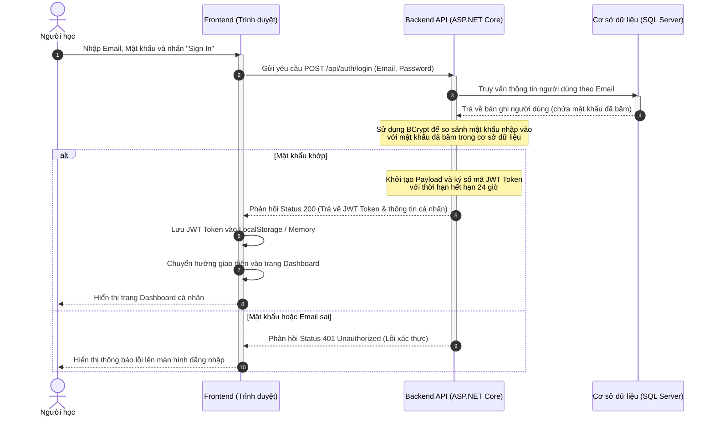
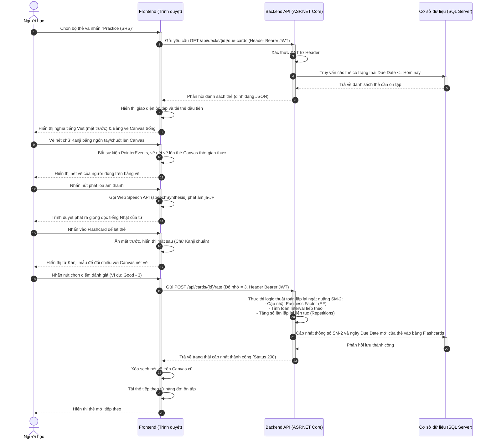

# CHƯƠNG 3. KHẢO SÁT VÀ PHÂN TÍCH (PHẦN 3)

---

## 3.4. Sơ đồ tuần tự (Sequence Diagram)

Sơ đồ tuần tự mô tả chi tiết sự tương tác theo trình tự thời gian giữa các thành phần trong hệ thống (Người dùng, Frontend Client, Backend API, Database) đối với các chức năng cốt lõi.

### 3.4.1. Chức năng Đăng nhập hệ thống

Quy trình xác thực người dùng và cấp phát mã bảo mật JWT:

---

### 3.4.2. Chức năng Ôn tập Flashcard và cập nhật lịch sử lặp lại ngắt quãng (SRS)

Quy trình truy xuất thẻ đến hạn ôn tập, tương tác bảng vẽ Canvas và cập nhật thông số tính toán SM-2:

---

## 3.5. Kết luận chương 3

Trong Chương 3, tác giả đã trình bày chi tiết quá trình khảo sát và phân tích hệ thống. Thông qua việc phân tích ưu và nhược điểm của các ứng dụng học tiếng Nhật hàng đầu hiện nay như Anki, Quizlet và Mazii, tác giả đã xác định rõ bài toán thực tiễn cần giải quyết: tích hợp một bảng vẽ Canvas hỗ trợ viết tay trực tiếp song song với quy trình ôn tập flashcard lặp lại ngắt quãng (SRS).

Từ nghiên cứu thực trạng, chương này đã đặc tả đầy đủ các yêu cầu chức năng (các phân hệ dành cho Người học và Quản trị viên, các tính năng cốt lõi như Canvas vẽ tay, phát âm TTS, nhập dữ liệu từ vựng hàng loạt, xem thống kê tiến trình học) cùng các yêu cầu phi chức năng về mặt hiệu năng độ trễ dưới 16ms của nét vẽ Canvas, tính tương thích đa thiết bị (Responsive) và an toàn bảo mật (JWT & BCrypt).

Cuối cùng, các sơ đồ ca sử dụng (Use Case) và sơ đồ tuần tự (Sequence Diagram) đã mô tả trực quan cấu trúc tương tác và dòng dữ liệu chạy thực tế giữa Frontend Client, ASP.NET Core API và cơ sở dữ liệu SQL Server. Kết quả phân tích chi tiết của chương này sẽ là kim chỉ nam trực tiếp để tác giả triển khai Chương 4: Thiết kế hệ thống và thiết kế cơ sở dữ liệu vật lý tiếp theo của đồ án.
