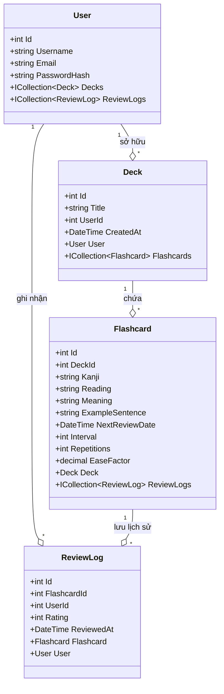
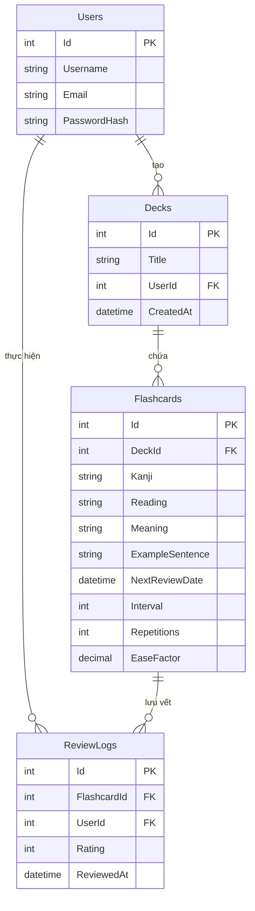

# CHƯƠNG 5. THIẾT KẾ HỆ THỐNG VÀ CƠ SỞ DỮ LIỆU (PHẦN 1)

Chương này trình bày chi tiết về thiết kế kiến trúc hệ thống, sơ đồ lớp đối tượng (Class Diagram) và thiết kế cơ sở dữ liệu vật lý của ứng dụng **JapanE** sử dụng Microsoft SQL Server 2022.

---

## 5.1. Thiết kế kiến trúc hệ thống

Ứng dụng JapanE được xây dựng dựa trên kiến trúc **Client-Server** phi trạng thái (Stateless), tách biệt hoàn toàn giữa giao diện người dùng và máy chủ dịch vụ thông qua RESTful HTTP API.

### 5.1.1. Kiến trúc phân tầng RESTful API
Hệ thống bao gồm ba phân tầng chính:
1. **Presentation Layer (Frontend Client):** Chạy trực tiếp trên trình duyệt web của người dùng sử dụng HTML5, CSS3 và Vanilla JavaScript. Giao diện gửi các yêu cầu HTTP (GET, POST, PUT, DELETE) kèm theo mã bảo mật JWT trong header để tương tác với Backend.
2. **Application & Infrastructure Layer (Backend API):** Xây dựng bằng ASP.NET Core 9.0. Lớp này chịu trách nhiệm định tuyến (Routing), kiểm tra quyền truy cập (Authentication Middleware), xử lý logic nghiệp vụ (Services) và tính toán lịch ôn tập (SrsService).
3. **Data Access Layer (Database):** Microsoft SQL Server 2022 chịu trách nhiệm lưu trữ dữ liệu. Giao tiếp dữ liệu giữa Backend và Database được quản lý thông qua Entity Framework Core (EF Core) hoạt động như một ORM.

Dưới đây là sơ đồ kiến trúc hệ thống tổng thể của ứng dụng JapanE, thể hiện sự tương tác phân tầng giữa client, máy chủ ứng dụng, cơ sở dữ liệu cùng quy trình đóng gói container Docker và tự động hóa CI/CD:

### 5.1.2. Sơ đồ lớp đối tượng (Class Diagram)
Sơ đồ lớp mô tả cấu trúc của các thực thể dữ liệu (Domain Entities) trong mã nguồn C# và các mối quan hệ giữa chúng:

---

## 5.2. Thiết kế cơ sở dữ liệu quan hệ

Cơ sở dữ liệu của hệ thống được thiết kế chuẩn hóa để tránh trùng lặp dữ liệu và đảm bảo tính toàn vẹn quan hệ giữa các đối tượng.

### 5.2.1. Sơ đồ thực thể quan hệ (ERD)

Mối quan hệ giữa các thực thể trong cơ sở dữ liệu:
* Một người dùng (Users) có thể tạo nhiều bộ thẻ (Decks) nhưng mỗi bộ thẻ chỉ thuộc về duy nhất một người dùng.
* Một bộ thẻ (Decks) có chứa nhiều thẻ từ vựng (Flashcards) nhưng một thẻ từ vựng chỉ thuộc về một bộ thẻ xác định.
* Một thẻ từ vựng (Flashcards) có nhiều lượt đánh giá lịch sử (ReviewLogs) để ghi nhận tiến trình học tập.
* Một người dùng (Users) có nhiều bản ghi lịch sử ôn tập (ReviewLogs).

---

### 5.2.2. Bảng đặc tả cơ sở dữ liệu vật lý (Physical Database Tables)

Cơ sở dữ liệu vật lý chạy trên SQL Server 2022 bao gồm 4 bảng dữ liệu chi tiết sau:

#### 1. Bảng `Users` (Lưu trữ thông tin tài khoản người dùng)
| Tên cột | Kiểu dữ liệu | Thuộc tính | Mô tả |
| :--- | :--- | :--- | :--- |
| **Id** | `INT` | Identity (1,1), Primary Key | Mã định danh người dùng duy nhất |
| **Username** | `NVARCHAR(100)` | Required, Not Null | Tên hiển thị người dùng |
| **Email** | `VARCHAR(256)` | Required, Not Null, Unique Index | Địa chỉ email đăng ký (dùng để đăng nhập) |
| **PasswordHash** | `VARCHAR(MAX)` | Required, Not Null | Chuỗi mật khẩu bảo mật đã băm qua BCrypt |

#### 2. Bảng `Decks` (Lưu trữ danh sách bộ thẻ học tập)
| Tên cột | Kiểu dữ liệu | Thuộc tính | Mô tả |
| :--- | :--- | :--- | :--- |
| **Id** | `INT` | Identity (1,1), Primary Key | Mã định danh bộ thẻ duy nhất |
| **Title** | `NVARCHAR(200)` | Required, Not Null | Tên chủ đề/tiêu đề bộ thẻ (Ví dụ: Từ vựng N5) |
| **UserId** | `INT` | Foreign Key, Not Null | Liên kết tới bảng `Users(Id)` (xóa cascade khi user bị xóa) |
| **CreatedAt** | `DATETIME2` | Not Null, Default (GETUTCDATE()) | Thời gian bộ thẻ được khởi tạo |

#### 3. Bảng `Flashcards` (Lưu trữ thông tin từ vựng tiếng Nhật và chỉ số lặp lại ngắt quãng SRS)
| Tên cột | Kiểu dữ liệu | Thuộc tính | Mô tả |
| :--- | :--- | :--- | :--- |
| **Id** | `INT` | Identity (1,1), Primary Key | Mã định danh thẻ từ vựng duy nhất |
| **DeckId** | `INT` | Foreign Key, Not Null | Liên kết tới bảng `Decks(Id)` (xóa cascade khi deck bị xóa) |
| **Kanji** | `NVARCHAR(200)` | Required, Not Null | Chữ viết Kanji hoặc chữ viết từ vựng gốc |
| **Reading** | `NVARCHAR(200)` | Not Null, Default ('') | Cách đọc chữ Kana (Hiragana/Katakana) |
| **Meaning** | `NVARCHAR(500)` | Required, Not Null | Định nghĩa, nghĩa từ vựng tiếng Việt |
| **ExampleSentence** | `NVARCHAR(1000)` | Nullable | Câu ví dụ tiếng Nhật kèm dịch nghĩa mẫu |
| **NextReviewDate** | `DATETIME2` | Not Null, Default (GETUTCDATE()) | Ngày đến hạn ôn tập thẻ kế tiếp |
| **Interval** | `INT` | Not Null, Default (1) | Chu kỳ lặp lại tiếp theo (tính theo số ngày) |
| **Repetitions** | `INT` | Not Null, Default (0) | Số lần người dùng ôn tập đúng liên tiếp |
| **EaseFactor** | `DECIMAL(5,2)` | Not Null, Default (2.50) | Hệ số độ nhớ (Easiness Factor), tối thiểu là 1.30 |

#### 4. Bảng `ReviewLogs` (Lưu lịch sử ôn tập thẻ của người dùng)
| Tên cột | Kiểu dữ liệu | Thuộc tính | Mô tả |
| :--- | :--- | :--- | :--- |
| **Id** | `INT` | Identity (1,1), Primary Key | Mã định danh lượt đánh giá duy nhất |
| **FlashcardId** | `INT` | Foreign Key, Not Null | Liên kết tới bảng `Flashcards(Id)` (xóa cascade) |
| **UserId** | `INT` | Foreign Key, Not Null | Liên kết tới bảng `Users(Id)` (không xóa cascade) |
| **Rating** | `INT` | Check (1-4), Not Null | Điểm tự đánh giá độ nhớ: 1=Forgot, 2=Hard, 3=Good, 4=Easy |
| **ReviewedAt** | `DATETIME2` | Not Null, Default (GETUTCDATE()) | Thời điểm học viên thực hiện đánh giá thẻ |
